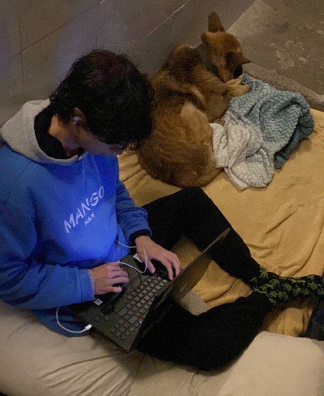

# Gustavo Truan
## Estudiante de Ingenieria en la UC de Chile  


```python
import requests
from PIL import Image
from io import BytesIO


URL = "http://www.pictures-of-gtruan-programming.com/{}"

image_bytes = requests.get(URL.format(1)).content
image = Image.open(BytesIO(image_bytes))

image.show()
```

